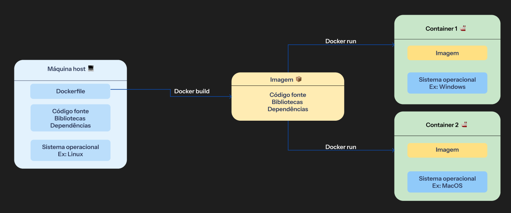
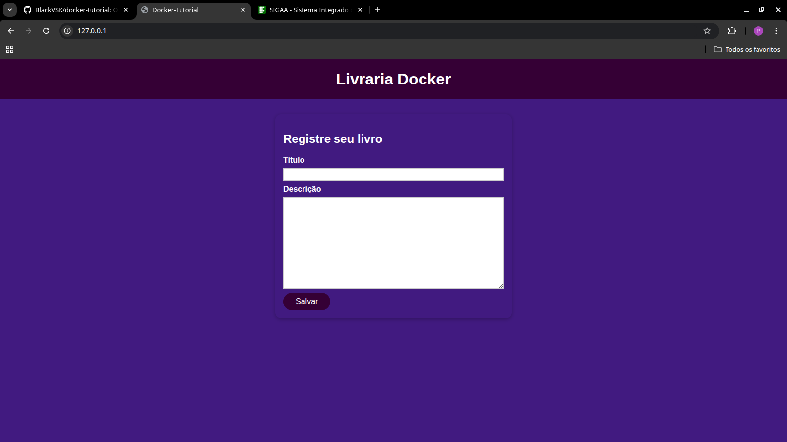
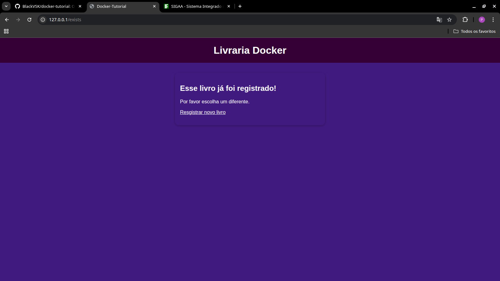
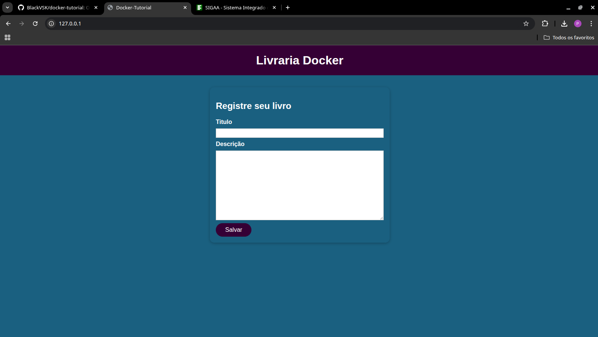

**Docker**

Tutorial introdutório sobre [docker](https://www.docker.com/) para desenvolvimento de aplicações, focando na criação de ambientes isolados e reprodutíveis. Este tutorial vai desde a construação de um Dockerfile até o deploy de containers na AWS, passando por conceitos como containers, Docker Hub, volumes, networks e docker-compose. Esse tutorial foi construído a partir do curso em vídeo [Docker & Kubernetes: The Practical Guide 2025 Edition](https://www.udemy.com/course/docker-kubernetes-the-practical-guide/?couponCode=ST7MT290425G3#instructor-2) do [Maximilian Schwarzmüller](https://github.com/maxschwarzmueller).
Esse tutorial está em constante desenvolvimento, envie sugestões e correções para meu [email](mailto:phrod2007@gmail.com).

---

**Trilha do Curso**

Esse tutorial é parte de uma trilha de aprendizado. Siga os links abaixo para acessar os outros cursos da trilha:

- [**Programação I**](https://github.com/ldmfabio/Programacao) ([Prof. Fábio Longo de Moura](https://github.com/ldmfabio)): Lógica de Programação com JavaScript.
- [**Desenvolvimento Web II**](https://eduardo-da-silva.github.io/aula-desenvolvimento-web/) ([Prof. Eduardo da Silva](https://github.com/eduardo-da-silva)): Desenvolvimento front-end com VueJS.
- [**Desenvolvimento Dispositivos Móveis III**](https://eduardo-da-silva.github.io/aula-desenvolvimento-mobile/) ([Prof. Eduardo da Silva](https://github.com/eduardo-da-silva)): Desenvolvimento para dispositivos móveis com Vue + Vite + PWA.
- [**Desenvolvimento Web III - Atual**](https://github.com/marrcandre/django-drf-tutorial) ([Prof. Marco André Lopes Mendes](https://github.com/marrcandre/)): Desenvolvimento back-end com Django e DRF, utilizando o [modelo de projeto](https://github.com/marrcandre/template_django_pdm).
- [**Desenvolvimento Web III (2023)**](https://github.com/marrcandre/django-drf-tutorial) ([Prof. Marco André Lopes Mendes](https://github.com/marrcandre/)): Desenvolvimento back-end com Django e DRF, do zero, sem utilizar o template.

Bons estudos!
---

# 1. O que é docker?

**Docker** é uma tecnologia de containers usada para criar e gerenciar containers. Em um software de desenvolvimento, o container é uma unidade padronizada de software, isso significa que é um pacote de código importante para que as dependências e ferramentas necessárias executem o código. Imagine que eu tenho uma peça de quebra cabeça e eu tiro uma peça desse quebra cabeça para colocar em outro, essa peça não foi feita para se encaixar a esse outro quebra cabeça e a única solução seria ter um quebra cabeça exatamente igual o meu. No contexto de desenvolvimento, o quebra cabeça seria meu ambiente de desenvolvimento e a peça desse quebra cabeça seria a aplicação, quando eu tiro a minha aplicação do meu ambiente que foi configurado conforme a necessidades da minha aplicação e passa para um ambiente na qual foi configurado para as necessidades de outra aplicação com diferentes necessidades, a minha aplicação pode e vai apresentar erros, é onde ocorre a famosa situação *" na minha máquina funciona "* e foi pensando na resolução desse tipo de problema que o docker foi criado. Vamos enteder muito mais colocando a mão na massa.


# 2. Instalação do docker

Para instalar o docker precisamos ver o [requisitos do sistema](https://docs.docker.com/get-started/get-docker/) para cada sistema operacional. Após verificado, seguimos para cada sistema

**2.1 Linux**

- Configure o repositório apt do Docker.

```shell
# Add Docker's official GPG key:
sudo apt-get update
sudo apt-get install ca-certificates curl
sudo install -m 0755 -d /etc/apt/keyrings
sudo curl -fsSL https://download.docker.com/linux/ubuntu/gpg -o /etc/apt/keyrings/docker.asc
sudo chmod a+r /etc/apt/keyrings/docker.asc

# Add the repository to Apt sources:
echo \
  "deb [arch=$(dpkg --print-architecture) signed-by=/etc/apt/keyrings/docker.asc] https://download.docker.com/linux/ubuntu \
  $(. /etc/os-release && echo "${UBUNTU_CODENAME:-$VERSION_CODENAME}") stable" | \
  sudo tee /etc/apt/sources.list.d/docker.list > /dev/null
sudo apt-get update
```

- Instale os pacotes do Docker.

```shell
sudo apt-get install docker-ce docker-ce-cli containerd.io docker-buildx-plugin docker-compose-plugin
```

- Verifique se a instalação foi bem-sucedida executando a imagem [hello-world](https://hub.docker.com/_/hello-world)

```shell
docker run hello-world
```

**2.2 Windows**

- A instalação do docker no Windows está listada na [documentação do docker](https://docs.docker.com/desktop/setup/install/windows-install/#start-docker-desktop)

**2.3 Mac**

- A instalação do docker no Mac está listada na [documentação do docker](https://docs.docker.com/desktop/setup/install/mac-install/)

**2.4 Como executar comandos no docker**

Para executarmos comandos no docker usamos a seguinte estrutura

```shell
docker <subcomando>  <opções>   <argumentos>
docker    run        -p 80:80      nginx  ##exemplo
```

# 3. Containers e Imagens

**3.1 Containers**

Os **containers** são ambientes isolados que permitem o empacotamento e execução de aplicações com todas as suas dependências e bibliotecas. O container Docker seria como uma máquina virtual, mas a grande diferença do container para uma VM é que ele não virtualiza o hardware, o que o torna mais leve, porém menos isolado. Para executarmos um container Docker, iremos usar a seguinte sintaxe:

```shell
docker run <nome da imagem>
```

O subcomando ``run`` diz ao docker que ele deve executar um comando baseado na imagem que eu determinei. Mas a final o que é uma imagem?

**3.2 Imagens**

As **imagens** são os templates para os containers, são elas que contêm o código e as ferramentas necessárias para executar esse código. Elas são o pacote compartilhado com as instruções para os containers, sendo que uma imagem pode ser usada em vários containers, porém o container deve executar só uma imagem. Existem duas formas de obter imagens: usando imagens pré-construídas ou criando suas próprias imagens.



**3.2.1 Imagens pré-construidas**

As imagens pré-construídas são imagens que foram construídas por pessoas ou organizações, podendo ser oficiais ou não, e você pode usar diretamente no seu projeto sem a necessidade de criar uma do zero. O principal repositório de imagens Docker é o [Docker Hub](https://hub.docker.com/explore) e basta procurar pela imagem desejada. Vamos a um caso prático, iremos executar um container baseado na imagem do [Ubuntu](https://hub.docker.com/_/ubuntu) e também iremos entrar no nosso container Ubuntu para executar comandos e vermos o isolamento em ação. Para conseguirmos a imagem do Ubuntu do Docker Hub, usaremos o comando docker pull com o nome da imagem que queremos puxar e também iremos verificar se o Docker puxou a imagem corretamente com o comando ``docker images``.

```shell
docker pull ubuntu
  Using default tag: latest
  latest: Pulling from library/ubuntu
  0622fac788ed: Pull complete 
  Digest: sha256:6015f66923d7afbc53558d7ccffd325d43b4e249f41a6e93eef074c9505d2233
  Status: Downloaded newer image for ubuntu:latest
  docker.io/library/ubuntu:latest

docker images
  REPOSITORY   TAG       IMAGE ID       CREATED      SIZE
  ubuntu       latest    a0e45e2ce6e6   7 days ago   78.1MB
```

Agora vamos executar o container com a imagem do Ubuntu que conseguimos e também o tornaremos interativo com o comando ``docker run -it``

```shell
docker run -it ubuntu
  root@231a78b0574c:/# 
```

Agora estamos dentro de uma máquina Ubuntu isolada da nossa máquina host. Podemos fazer o que quisermos dentro dessa máquina, mas iremos apenas verificar os diretórios existentes e criar um usuário novo.

```shell
root@231a78b0574c:/# ls
  bin  boot  dev  etc  home  lib  lib64  media  mnt  opt  proc  root  run  sbin  srv  sys  tmp  usr  var
root@231a78b0574c:/# useradd -m black
root@231a78b0574c:/# cd home
root@231a78b0574c:/home# ls
  black  ubuntu
root@231a78b0574c:/home# exit
  exit
```

Como visto, o container está isolado da nossa máquina e podemos configurá-lo conforme nossas necessidades. Podemos ver os containers que estão em execução no momento usando o comando ``docker ps`` e podemos pará-lo com o comando ``docker stop`` seguido por seu ID ou nome. Quando o container é interativo, como é o caso desse container Ubuntu, o container se desliga automaticamente quando saímos dele, mas ainda podemos vê-lo usando o comando ``docker ps -a`` e após isso excluí-lo com o comando ``docker rm`` seguido por seu ID ou nome. Lembrando que só é possível excluir um container se ele estiver desligado.

```shell
docker ps -a
  CONTAINER ID   IMAGE     COMMAND       CREATED          STATUS                     PORTS     NAMES
  231a78b0574c   ubuntu    "/bin/bash"   28 minutes ago   Exited (0) 2 minutes ago             vigilant_stonebraker
  
docker stop 231a78b0574c
  231a78b0574c

docker rm 231a78b0574c
  231a78b0574c
```

Após excluir o container, podemos excluir a imagem que já não está mais em uso com o comando ``docker rmi`` seguido do nome da imagem ou seu ID. Uma imagem não pode ser excluída enquanto houver containers que utilizam essa imagem, então certifique-se de excluir todos os containers que usam essa imagem.

```shell
docker images
  REPOSITORY   TAG       IMAGE ID       CREATED      SIZE
  ubuntu       latest    a0e45e2ce6e6   7 days ago   78.1MB

docker rmi ubuntu
  Untagged: ubuntu:latest
  Untagged: ubuntu@sha256:6015f66923d7afbc53558d7ccffd325d43b4e249f41a6e93eef074c9505d2233
  Deleted: sha256:a0e45e2ce6e6e22e73185397d162a64fcf2f80a41c597015cab05d9a7b5913ce
  Deleted: sha256:8901a649dd5a9284fa6206a08f3ba3b5a12fddbfd2f82c880e68cdb699d98bfb
```

**3.2.2 Imagens pessoais**

Imagens pessoais são aquelas que criamos para projetos específicos usando, ou não, imagens base. Para criarmos uma imagem, vamos precisar criar um arquivo ``Dockerfile`` no diretório onde se encontra o projeto, e esse Dockerfile terá um template que serve para criar qualquer imagem. O Dockerfile é o arquivo utilizado para criação de imagens docker.

```Dockerfile
FROM <Imagem base>  ##Permite que você crie sua imagem a partir de uma imagem pré-construída

WORKDIR <Nome do diretório principal>  ##Cria um diretório onde a aplicação ficará e os comandos serão executados

COPY <Diretório da máquina host> <Diretório do container> ##Copia todos os arquivos e pastas do caminho do host e coloca dentro do container

RUN <comando>  ##Executa comandos, geralmente usado para instalação de dependências

EXPOSE <porta>  ##Como o container é uma máquina isolada, devemos especificar onde a máquina estará escutando

ENV <variável de ambiente> <valor> ##Define variáveis de ambiente (não recomendado no caso do compartilhamento do Dockerfile)

CMD ["<comando1>", "<comando2>"]  ##Diferente do RUN, o CMD irá executar o comando somente quando o container entrar em execução
```

Após criado o Dockerfile, temos que dar o comando ``docker build``, usando ``.`` para definir onde o arquivo Dockerfile está e também usaremos a opção **-t** para darmos um nome e uma tag.

```shell
docker build -t name:tag .
```

Vamos para um exemplo prático. Usaremos a aplicação de formulario basico em Vue.js, localizado na pasta [exemplos](exemplos/formulario-vue). Iremos começar construindo nosso Dockerfile dentro da pasta:

```Dockerfile
FROM node:18

WORKDIR /app

COPY package.json .

RUN npm install

COPY . .

EXPOSE 5173  ##porta padrão do vue.js

CMD ["npm", "run", "dev", "--", "--host"]
```

Em seguida devemos navegar no terminal até a pasta do dockerfile e após isso podemos executar o docker build

```shell
cd exemplos/formulario-vue
docker build -t forms-vue:v1 .
```

Agora iremos executar um container Docker para rodar a aplicação. Usaremos três opções para rodar esse container: ``-p porta-do-host:porta-do-container``, que redireciona as portas; o ``--name``, que nomeia o container; e o ``--rm``, que exclui o container assim que ele é parado.

```shell
docker run -p 8080:5173 --name container-formulario --rm formulario-vue:v1
```

Pronto, nossa aplicação está rodando na porta 8080 do [localhost](http://localhost:8080). Agora podemos colocá-la em um repositório no Docker Hub. Para isso, basta criar uma conta no Docker Hub e criar um repositório. Após a criação do repositório, deve aparecer o comando necessário para enviarmos a imagem:

```shell
docker push <nome do usuario Docker Hub>/<nome do repositório Dockerhub>:tag
```

Para que a imagem seja enviada ao repositório, devemos renomeá-la com o nome correto, e podemos fazer isso com o comando ``docker tag nomeIMG-original:tag nomeIMG-novo:tag``. O comando ``tag`` na verdade cria uma nova referência para a imagem original com outro nome. Após renomeá-la, basta usar o comando **push** para enviá-la ao repositório no Docker Hub:

```shell
docker tag forms-vue:v1 blackvsk/formulario-vue:v1
docker push blackvsk/formulario-vue:v1 ##lembre-se de usar o seu usuário e o seu repositório
```

Enfim, nossa imagem Docker está em um repositório no Docker Hub. Podemos até mesmo excluir a imagem local e baixá-la novamente usando o comando ``run``:

```shell
docker rmi blackvsk/formulario-vue:v1
docker run -p 8080:5173 --name container-vue --rm blackvsk/formulario-vue:v1
```

# 4. Volumes e Bind Mount

**4.1 O que são volumes nomeados?**

Volumes são pastas que você informa ao Docker para que ele mapeie para pastas dentro do container, criando uma ligação entre essas pastas, onde qualquer modificação feita em uma reflete na outra. Isso garante que todos os dados que os containers recebem fiquem guardados mesmo que eles sejam derrubados, sendo possível subir um novo container utilizando o mesmo volume.

**4.2 Como utilizar volumes nomeados**

Você pode criar um volume na hora de subir um container do Docker com a opção ``-v``:

```shell
docker run -p 80:80 -v <nome do volume/pasta>:<pasta dentro do container> <imagem>
```

Temos o projeto feedback-app na pasta [exemplos](exemplos/feedback-app), que iremos utilizar para ver os volumes na prática. A aplicação é simples: uma livraria onde você registra o nome do livro e a descrição dele. Uma vez inserido o nome, mais nenhum livro pode receber o mesmo nome.

Inicialmente o site não funcionará da forma que queremos, pois não temos um volume. Então, vamos para a implementação na prática, começando com o build da nossa imagem:

```shell
cd exemplos/feedback-app/
docker build -t feedback:volume .
```

Logo em seguida, podemos subir nosso container:

```shell
docker run -p 80:3000 --rm --name fomulario -d feedback:volume
```

Agora nosso container está rodando em [localhost](http://localhost). (Caso ocorra erro por já haver outro container na mesma porta, utilize o comando ``docker stop`` para parar o container).

Você verá que nossa aplicação ainda está permitindo que você digite o mesmo nome várias vezes, pois não estamos armazenando as informações em lugar algum.



Então vamos corrigir isso. Começamos derrubando o container:

```shell
docker stop formulario
```

Na pasta da aplicação temos a pasta [feedback](exemplos/feedback-app/feedback/), que será conectada à pasta dentro do container. Podemos subir nosso container novamente, desta vez adicionando a opção ``-v``:

```shell
docker run -p 80:3000 --rm --name fomulario -d -v feedback:/app/feedback feedback:volume
```

Dessa vez, ao tentarmos registrar o mesmo livro mais de uma vez, recebemos uma mensagem dizendo que já existe um livro com esse nome e para selecionar outro. Ou seja, nosso volume está guardando os dados inseridos na nossa aplicação da forma como queríamos.



E o melhor: mesmo que derrubemos o container com um ``docker stop``, se levantarmos o container com o mesmo volume, as informações dos livros registrados ainda estarão presentes. Para identificar os volumes e, caso desejado, apagá-los, usamos os comandos:

```shell
docker volume ls  ##lista volumes
  DRIVER    VOLUME NAME
  local     feedback

docker volume rm feedback ##deleta volumes
```

**4.3 o que são Bind Mounts**

Bind mounts (ou montagem por ligação) têm função semelhante aos volumes nomeados, sendo também uma pasta na máquina host conectada a uma pasta no container. A diferença é que não iremos criar uma pasta exclusivamente para ser volume no host. Em vez disso, usaremos a própria pasta do nosso projeto como volume.

Com isso, qualquer alteração feita no código surtirá efeito imediatamente no container, o que é ótimo em ambientes de desenvolvimento para testes.

Vamos à prática. Vá até o arquivo de [css](exemplos/feedback-app/public/styles.css), mude o background do body para black e, em seguida, recarregue a página. Nossa aplicação continuará com o mesmo background. Para mudar, teríamos que fazer todo o processo de build novamente.

Mas, em vez disso, vamos derrubar nosso container e adicionar um bind mount, apontando o caminho da pasta [feedback-app](exemplos/feedback-app/) no host e o diretório correspondente no container. Ao rodarmos o comando, recebemos um erro dizendo que o Node não achou o módulo express presente em node_modules. Isso acontece porque não rodamos npm install na máquina local, e o diretório do host sobrescreve o do container:

```shell
docker run -p 80:3000 --rm --name fomulario -v /app/node_modules -v /home/black/Documentos/docker-tutorial/exemplos/feedback-app:/app feedback:volume
```

```shell
> data-volume-example@1.0.0 start
> node server.js

node:internal/modules/cjs/loader:1404
  throw err;
  ^

Error: Cannot find module 'express'
...
```

Dependências em projetos simples podem ter entre 30–60MB, e em projetos maiores podem chegar a 200MB. Isso, a longo prazo, pode ser um problema para máquinas com menos armazenamento.

A solução será usar um **volume anônimo**, que é um volume que só existe enquanto o container estiver no ar. Usaremos isso para armazenar dados temporariamente, como é o caso do node_modules.

Para declarar um volume anônimo, basta usar a opção ``-v`` e colocar apenas a pasta dentro do container:

```shell
docker run -p 80:3000 --rm --name formulario -v /app/node_modules -v /home/black/Documentos/docker-tutorial/exemplos/feedback-app:/app feedback:volume
```

Pronto! Agora podemos mexer livremente no nosso código e, ao recarregar a página, veremos as mudanças refletidas na aplicação.



**4.4 Comparativo entra Volume nomeados, Volumes anônimos e Bind Mount**

| Característica              | **Volume Nomeado**                                     | **Bind Mount**                                             | **Volume Anônimo**                                      |
|----------------------------|--------------------------------------------------------|------------------------------------------------------------|---------------------------------------------------------|
| **Criação**                 | Docker gerencia automaticamente                       | Usuário define o caminho completo da pasta no host         | Criado automaticamente e sem nome                       |
| **Persistência dos dados** | Sim, mesmo após parar/remover o container             | Sim, enquanto o caminho no host existir                   | Não, é temporário (só dura enquanto o container estiver ativo) |
| **Localização**            | Docker armazena em `/var/lib/docker/volumes/`         | Qualquer caminho válido no sistema de arquivos do host     | Diretório gerenciado automaticamente pelo Docker        |
| **Uso principal**          | Armazenamento persistente em produção                 | Desenvolvimento, pois reflete alterações em tempo real     | Armazenamento temporário (ex: `node_modules`, cache)    |
| **Facilidade de backup**   | Fácil, pois os volumes são nomeados e gerenciados     | Médio, depende da estrutura do host                        | Difícil, pois o nome é aleatório e não costuma ser reutilizado |
| **Portabilidade**          | Alta – não depende de caminhos absolutos              | Baixa – depende da estrutura local do host                 | Baixa – não é reutilizável entre containers             |
| **Comando de uso**         | `-v volume_nome:/app/pasta`                           | `-v /caminho/absoluto:/app/pasta`                         | `-v /app/pasta` (sem nome do volume no host)           |